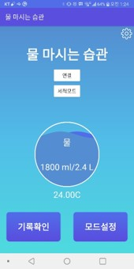
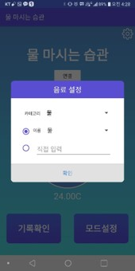

## 📑 프로젝트 소개
음료에 대한 정보를 기록하고 측정할 수 있습니다.

## ⚙ 개발 언어 
- Language : Java

## 📱 앱 사진

* 메인 이미지
  * 하루에 마셔야 하는 물 양을 얼마나 마셨는지 알 수 있습니다. 
  * 물 온도와 같은 정보를 나타내준다. 
     

* 음료 측정
  * 물이 들어오면 물 정보에 대한 내용을 표기해야한다. 
     
